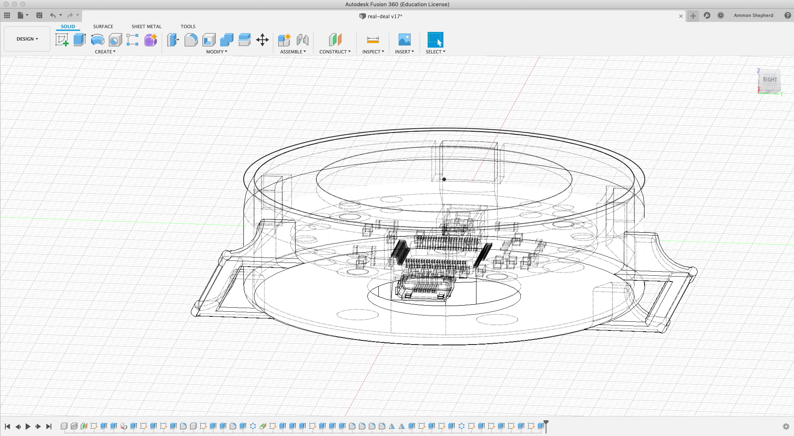
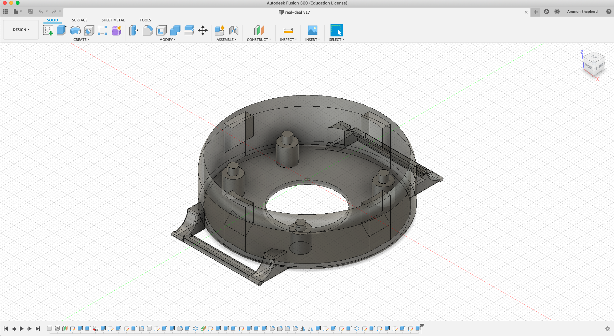
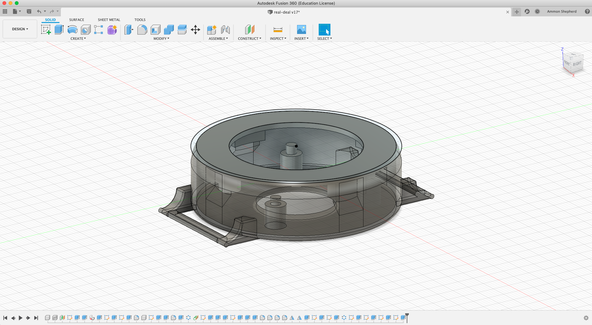
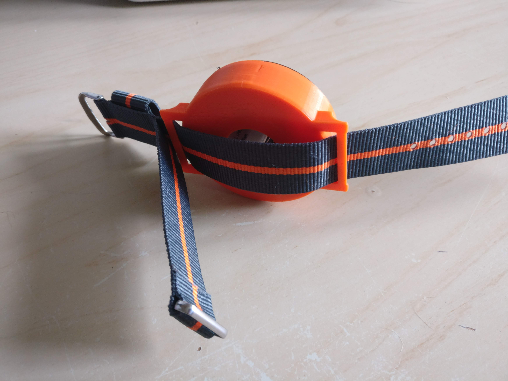
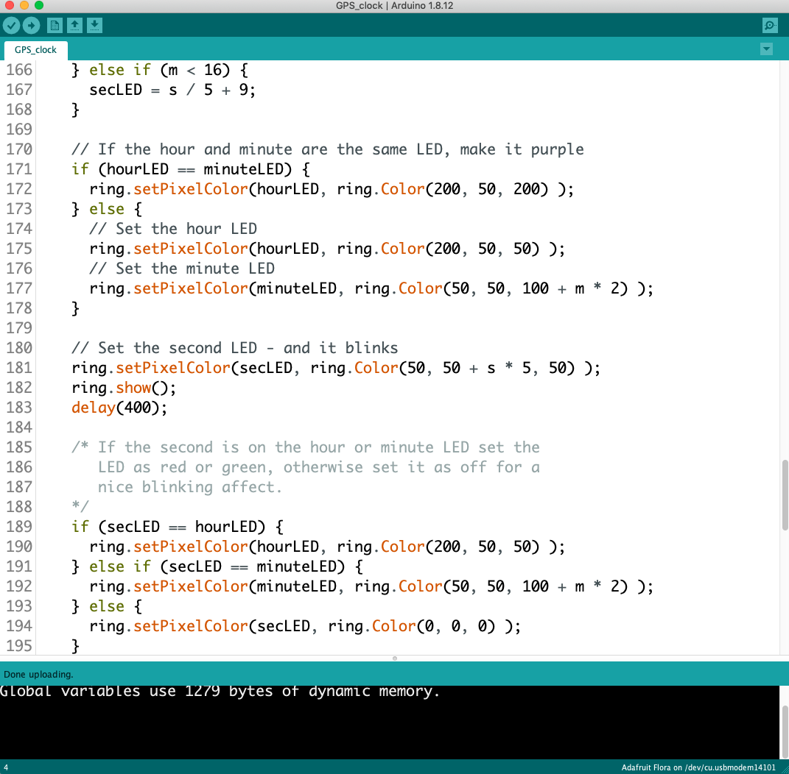

*[LED Watch in all the Glory]*

This is the final post about the LED watch. (Read the first post here: [LED
Watch Making - Dec 17,
2019](https://scholarslab.lib.virginia.edu/blog/led-watch-making/)) I was able
to complete the build after *many* attempts at designing the case and few long
hours with the code. Neither are perfect. But as the saying goes, perfect is
the enemy of done.

This post will describe the design issues making the case, the code, and ideas
for developing the watch going forward.

## The Case
I designed the case using the free education license of Fusion 360. Two things
made designing the case very easy.
1. The website, [grabcad.com](grabcad.com) exists, and
   [davidrmillar](https://grabcad.com/library/adafruit-flora-wearable-v3-1)
   made a detailed model of the Adafruit Flora wearable PCB that is the basis
   of the watch. I used the model to design the posts, tabs, and other features
   in the right place and to the right scale.
2. The video tutorials of [Noe
   Ruiz](https://www.youtube.com/watch?v=GlMo6IWF6CY&list=PLjF7R1fz_OOVsMp6nKnpjsXSQ45nxfORb&index=6&t=0s)
   from Adafruit. There are a couple of his videos that were exactly what I
   needed. And a bonus were the many Fusion 360 tips and procedures that make
   any project I do going forward much better.

*[The many iterations of the case]*

Despite the model and the videos, the case took many, many iterations to get
the present state. (Notice I didn't say finished state? More on that later.)

*[fusion 360 - wireframe]*

*[fusion 360 - watch model 1]*

*[fusion 360 - watch model 2]*

The lid was difficult to design for. My first idea was to have basically a flat disc that would twist into place and be held in with a couple of notches. This didn't work out well, as my tolerances between slots and tabs were too large and the lid was not stable when in place. 

So, instead, I decided to use friction as the force to keep the lid on the case. I designed the case to have four shafts that fit over notches in the case. This provided a very tight fit.

*[Lid with tangs]*

One thing that is immediately noticeable (it was the first thing all of the kids said when they first saw it) is that the case is large! This is because the electronics inside are large. Adding a battery means the case is even larger because I had to increase the circumference to allow for the battery cables to plug into the Flora, and increase the height of the case as the battery sits under the Flora.

I had wanted the case to be more rounded, like one of those peppermint candy disks, but it 3D prints better with a flat bottom. So it ended up not as rounded as I would like it to be, but overall it looks pretty decent.

I was going to make a band out of leather, but I found one through Amazon while looking for ideas on how to attach the band to the case. It looked great and was cheap, so I went that route. The attachment part was easy to design for, but I had to keep in mind the limitations of the 3D printer, so everything had to be at a 45 degree angle and touching the bed.

*[Watch band]*

The STL files for the case and lid are available at the GitHub repo (
[https://github.com/ammonshepherd/led-watch ](https://github.com/ammonshepherd/led-watch) ), as well as
the Fusion 360 file for your own remixing pleasure.

## The Code

*[The code]*

The code to make the watch work never really worked 100%. The watch relies on a GPS module to get accurate time from satellites. That in itself is really awesome, but the GPS module never seemed to get a good, consistent fix on any satellites. So if the watch does show the time, it's pretty iffy. I could try to code the time all from scratch, but since the GPS module is there, I wanted it to use the hour, minute and second from the GPS in order to tell the correct time. In order to get a good fix on the satellite, the GPS needs to be outside for 5-45 minutes. Every time I had scheduled to do this, it was freezing outside and I don't want to sit in the cold, so I give up after 5 minutes. It's much warmer now, so I'll have to give it another try.

*[Blinking Lights]*

Several issues came up while coding the watch. Getting the LEDs to light at the same time was a bit counter-intuitive. I had to look at several examples, and play around with it to get multiple LEDs at the same time. It's actually pretty strait forward. Getting the seconds to blink was more tricky. They still don't blink 5 times (5 seconds) for each LED, but it's close enough.

The [code is in GitHub](https://github.com/ammonshepherd/led-watch), and pretty well commented.

## The Future

The LEDs can get really, really bright. I want to add a button to the case that
will turn the watch into a flashlight. A simple iteration of button presses
could allow for multiple brightnesses. One press to show low light, two for
medium brightness, and three for full brightness, and fourth to turn off. This
would be really easy to design change for the case, and a button is easy enough
to find and solder onto the board.

For keeping time more acurately, I'd like to find a more reliable source than a
GPS module. It's fun to think that the watch gets the time from satellites
zipping around in space, but it's not reliable, especially when indoors. 

Another idea was to tap into some sort of data stream; either social media or
government data or something of the sort. The LEDs can flash different colors
and patterns based on the data it receives. Like a circular pattern in blue when a
new comment is made on your social media platform of choice. Or (a bit more
macabre and to the times) when a new case of COVID-19 is detected in your city,
county or state, the lights could flash red, and the speed of flashing is
faster the closer it is to your location.

